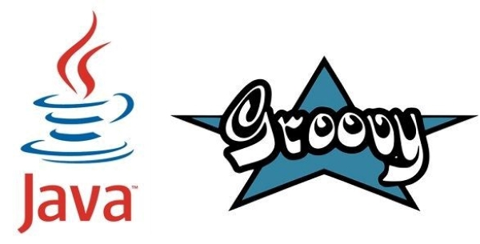

# 项目说明

关键是基于Maven构建一个Java和Groovy共存的项目。



Maven的pom.xml文件调好后，明明已安装好Groovy，却还是报错：
```text
Cannot resolve org.codehaus.groovy:groovy-all:3.0.5
```

原先的XML片段：
```xml
<dependency>
    <groupId>org.codehaus.groovy</groupId>
    <artifactId>groovy-all</artifactId>
    <version>3.0.5</version>
</dependency>
```

修改后的XML片段：
```xml
<dependency>
    <groupId>org.codehaus.groovy</groupId>
    <artifactId>groovy-all</artifactId>
    <version>3.0.5</version>
    <type>pom</type>
</dependency>
```

这样就正常了！
