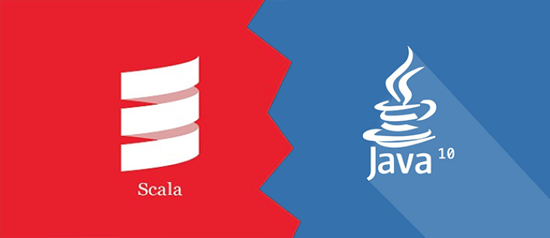

## 项目说明

关键是基于Maven构建一个Java和Scala共存的项目。



当然，除了Java之外，Scala的环境也是需要配置的！IDEA也需要配置Scala插件！

项目编译时疯狂报错：
```text
No compiler is provided in this environment. Perhaps you are running on a JRE rather than a JDK?
```
可以设置Maven的Runner处的JDK！

网传一则有用的命令是：
```text
mvn clean kotlin:compile package
```
